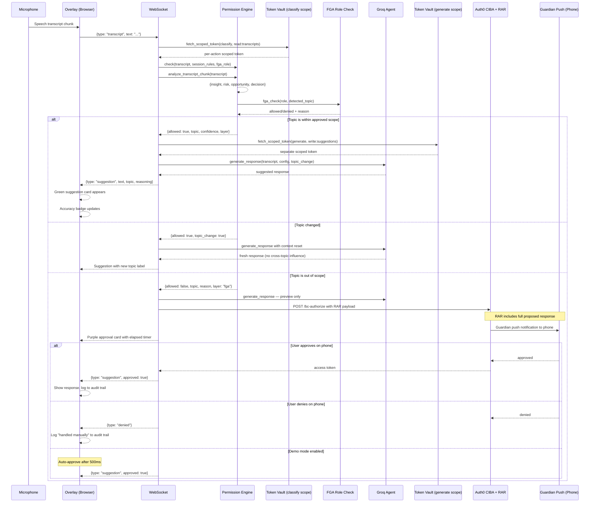

# Proxy Me

An AI meeting assistant that whispers responses in your ear and always asks before doing anything sensitive.

Built for the **Authorized to Act: Auth0 for AI Agents** hackathon using Auth0 Token Vault, CIBA with Rich Authorization Requests, and Fine Grained Authorization.

---

## Architecture



---

## What it does

Proxy Me sits as a floating overlay beside your meeting window. It listens to the conversation and responds when appropriate.

**Core Features**

Auto-responds to topics within your authorized scope based on FGA role, category toggles, and natural language rules.

Fires a CIBA step-up request for anything outside scope. The RAR payload shows the full proposed response in the Guardian notification so you know exactly what you are approving.

Logs every decision to a shareable audit trail with conversation analytics (insights, risks, opportunities, decisions extracted from each transcript chunk).

Exports audit logs via webhook to external tools using the `/api/export/{session_id}` endpoint.

Never reuses tokens. Each action gets its own minimal-scope Token Vault token.

Detects topic changes and resets the AI context to avoid cross-topic influence. When the meeting shifts from "pricing" to "technical implementation", the AI knows to disregard previous constraints.

Shows real-time authorization flow in the overlay. Every Token Vault fetch, FGA check, and CIBA initiation displays as it happens.

**Overlay Features**

Accuracy badge shows the percentage of recent suggestions that were used or approved (last 10 decisions).

Role status displays your current FGA role and allowed topics.

Demo mode toggle lets you auto-approve CIBA requests for testing and presentations.

---

## Auth0 Features Used

| Feature | How it is used |
|---------|----------------|
| Token Vault | Per-action scoped tokens. classify_transcript gets read:transcripts. generate_response gets write:suggestions. Each token is single-purpose and short-lived. |
| CIBA | Step-up approval for out-of-scope topics. POST /bc-authorize with polling and Guardian push notifications. |
| RAR | Rich Authorization Requests send the full proposed response via authorization_details. The Guardian notification shows exactly what the AI wants to say before you approve. |
| FGA | Role-based topic permissions. Sales Engineer auto-approves pricing and technical. Junior AE gets general conversation only. Executive gets everything. |
| Flow Ticker | Every Token Vault fetch, FGA check, and CIBA initiation streams to the overlay in real time. The authorization layer is visible during live sessions. |

---

## Stack

Backend: FastAPI, AsyncGroq (llama-3.3-70b-versatile), Auth0 for AI Agents  
Frontend: Vanilla JS, Web Speech Recognition API  
Deploy: Railway

---

## Setup

```bash
git clone https://github.com/tazwaryayyyy/ProxyME
cd proxyme
pip install -r requirements.txt
cp .env.example .env
```

Fill in your environment variables (see below), then start the server:

```bash
uvicorn backend.main:app --reload --port 8000
```

Open http://localhost:8000

---

## Environment Variables

```
GROQ_API_KEY=your_groq_api_key

# Auth0 credentials
AUTH0_DOMAIN=dev-xxxx.us.auth0.com
AUTH0_CLIENT_ID=your_client_id
AUTH0_CLIENT_SECRET=your_client_secret
AUTH0_AUDIENCE=https://dev-xxxx.us.auth0.com/api/v2/

# For CIBA notifications - the Auth0 user ID enrolled in Guardian
AUTH0_USER_ID=auth0|your_user_id_here

# Optional: override with a specific email for Guardian push
AUTH0_USER_EMAIL=your@email.com
```

---

## File Structure

```
proxyme/
├── backend/
│   ├── main.py              # FastAPI, WebSocket, audit log, per-action tokens
│   ├── groq_agent.py        # AsyncGroq response generation + topic change handling
│   ├── permission_engine.py # 3-layer check: custom rules → FGA → category toggles
│   ├── auth0_client.py      # Token Vault, CIBA+RAR, FGA roles
│   └── models.py            # Pydantic models
├── frontend/templates/
│   ├── index.html           # Setup: role selector, confidence slider
│   ├── overlay.html         # Floating overlay with CIBA polling, accuracy badge, demo mode
│   └── summary.html         # Post-meeting stats + shareable decision trail
├── railway.json
├── nixpacks.toml
└── requirements.txt
```

---

## Shareable Audit Trail

Every session generates a public audit URL:

```
https://web-production-cc743.up.railway.app/audit/<session_id>
```

Shows every decision: topic detected, FGA layer, confidence, token scope, approval status, timestamp, and conversation analytics (extracted insights, risks, opportunities, decisions).

---

## Webhook Export

Export session audit logs to external systems:

```bash
curl -X POST "https://your-domain.com/api/export/<session_id>?webhook_url=https://your-webhook.com/endpoint"
```

Payload sent to webhook:
```json
{
  "session_id": "abc123",
  "log": [
    {
      "transcript": "What are your pricing tiers?",
      "topic": "pricing",
      "allowed": false,
      "analysis": {
        "insight": "Pricing discussion initiated",
        "risk": "Potential budget mismatch",
        "opportunity": "Upsell to enterprise tier",
        "decision": null
      }
    }
  ]
}
```

---

## Bonus: Building This for the Auth0 Hackathon

### Token Vault in a Live WebSocket: What the Docs Do Not Cover

Every Auth0 Token Vault tutorial covers secure credential storage, scoped tokens, and zero trust principles. What none of them cover is what happens when you call it 10 times per minute inside a live meeting WebSocket, and why the obvious first implementation falls apart.

Proxy Me runs a permission check on every transcript chunk that comes through during a meeting. For a 30 minute call that is somewhere between 80 and 120 chunks. Each one needs to be classified. Each approved classification needs a response generated. I designed it to call Token Vault for both operations separately, with classify_transcript and generate_response each getting their own token.

**The latency I did not account for**

I assumed Token Vault calls would be fast. Auth0 infrastructure, should be under 100ms. What I actually measured: the first call in a session hit around 340ms. After the management token was cached in memory, subsequent calls dropped to about 80ms. That sounds fine until you stack it with everything else in the pipeline. Transcript arrives, WebSocket handler fetches from Token Vault, then waits for Groq classification, then waits for response generation. Total time before a suggestion card shows up in the overlay: 1.2 to 1.8 seconds.

For a meeting, 1.8 seconds is workable for a suggestion you are going to read and speak yourself. But when the approval card is for a sensitive topic and someone across the call is waiting for your answer, that gap is uncomfortable. The async setup helped because the WebSocket kept receiving new chunks without blocking. The person on the other side of the call does not know that though.

The fix was straightforward once I saw the problem: cache the management token on first use and only refresh it when a 401 comes back. That cut the cold start cost from 340ms to under 90ms. The deeper fix was rethinking how many scopes I actually needed.

**Scope granularity vs real time UX**

My first version used four scopes: read:transcripts, classify:topics, write:suggestions, approve:responses. Conceptually that is the right posture. In practice, four sequential Token Vault fetches per chunk meant the conversation had already moved on by the time anything appeared. I collapsed it to two: read:transcripts for classification and write:suggestions for generation.

What I took from this is that scope granularity and real time UX pull in opposite directions. You want one token per atomic action for security. You want zero added latency for usability. In a meeting context, two scopes per chunk is roughly the ceiling before it starts feeling broken. Beyond that you need to either batch the fetches or accept that your product stops working in the environment it was built for.

**Where CIBA and RAR actually got difficult**

I was most excited about the CIBA flow and also most surprised by where it broke. The basic idea works: detect a sensitive topic, call /bc-authorize with a Rich Authorization Request payload, send a Guardian push to the user's phone, wait for approval, release the response. Cryptographically clean, genuinely out of band.

The first problem was the authorization_details character limit. Auth0 does not document this clearly. I was passing the full proposed response text as part of the RAR payload, sometimes 200 characters or more, along with topic metadata. On longer responses, /bc-authorize returned 200 but the Guardian notification came through truncated. The user would see something like "AI wants to say: 'Our enterprise pricing is customi...'" with no way to see the rest. That is not a meaningful approval.

I capped the RAR payload at 80 characters and showed the complete proposed response in the overlay card instead. The Guardian notification becomes the authorization trigger rather than the full context. It works, but it is a tradeoff I did not want to make.

The second problem was task management inside the WebSocket handler. My first version awaited the CIBA result synchronously, which blocked the entire handler while waiting for a phone approval that might take 20 seconds. New transcript chunks piled up unprocessed. Switching to asyncio.create_task() for every incoming transcript fixed it. Each chunk processes independently and approvals resolve in their own task. Auth0's CIBA documentation assumes HTTP request response flows, so this pattern is not covered anywhere I could find.

**FGA made the setup page make sense**

I added Fine Grained Authorization after realizing I was asking users to do something annoying: manually toggle topic categories before every meeting. A Sales Engineer should not have to think about whether "pricing" is enabled. That is what their job is. The role should carry the permissions.

Four roles: Junior AE gets general conversation only. Sales Engineer gets technical and pricing too. Legal gets general and technical but not commitments. Executive gets everything. The permission engine checks FGA first, then custom natural language rules, then the category toggles. Three layers, and each one writes to the audit trail so you can see exactly which layer made the decision and why.

The FGA work also showed me a gap in how Token Vault currently works. Ideally, a Junior AE session should be incapable of fetching a write:pricing-responses token at the vault level, not just blocked by application logic. Right now the permission check happens in code and the token issuance happens separately. Those two things should be connected, and I think that is where Token Vault has the most room to evolve.

**Topic change detection and conversation analytics**

Two features I added late but turned out to be essential. Topic change detection compares the current topic to the previous one. When the meeting shifts from discussing "pricing" to asking about "technical implementation", the AI gets a fresh context reset. Without this, the AI would try to answer technical questions with pricing constraints still in mind.

Conversation analytics runs in parallel with every classification. Groq extracts insights, identifies risks, spots opportunities, and notes any key decisions from each transcript chunk. These go into the audit log and could feed into CRM systems via the webhook export. The analytics do not block the response pipeline, they run as a background task and append to the audit trail when ready.

**Three things worth knowing before you build this**

Cache the management token from the first request. Fetching it on every operation costs you 300ms each time and makes real time features feel sluggish.

Start with two scopes. Add more only when you have measured latency budget to spend. Removing scopes later is harder than adding them.

Test on a real device before your deadline. The Guardian emulator and actual push notifications behave differently in ways that matter: character limits, timing, how long the notification stays on screen. None of it is obvious until you are holding your phone and running a real session.

Use demo mode for presentations. The demo toggle in the overlay auto-approves CIBA requests after 500ms, which makes for a much smoother demo than waiting for Guardian pushes. Just remember to turn it off for actual meetings.

---

## License

MIT
